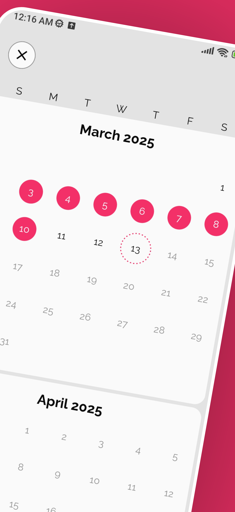
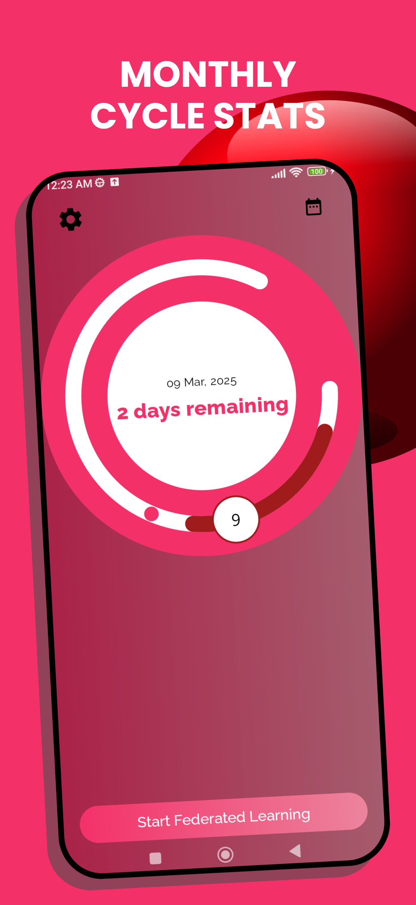
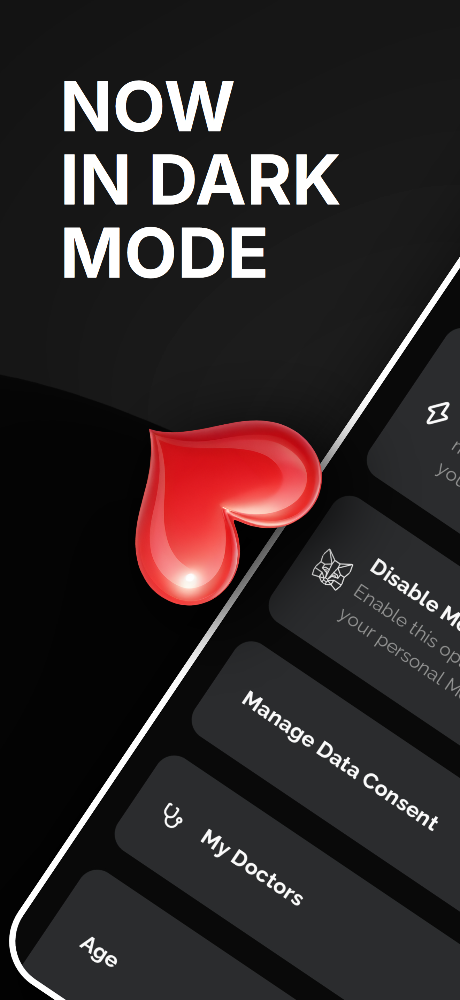
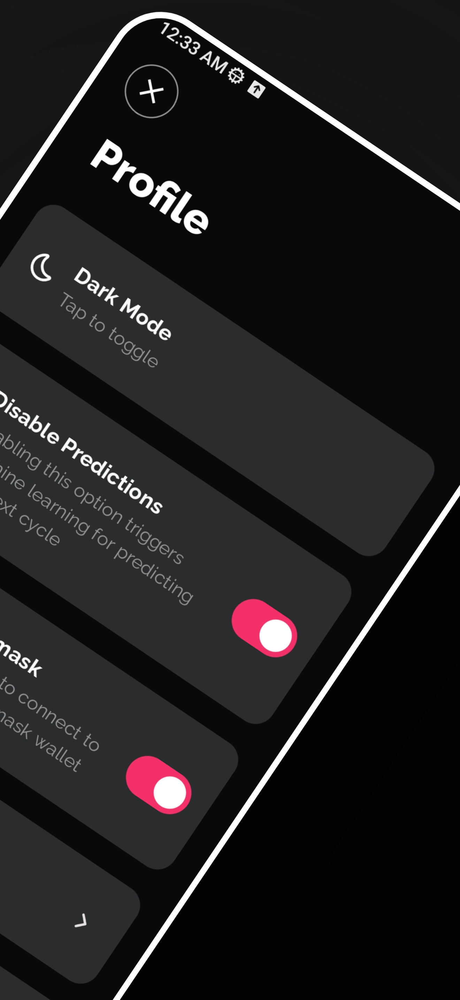

# [FLORA - Period Tracker](https://play.google.com/store/apps/details?id=com.chriskaras.flora)

|                                                                     |                                                                     |                                                                     |                                                                     |
|:-------------------------------------------------------------------:|:-------------------------------------------------------------------:|:-------------------------------------------------------------------:|:-------------------------------------------------------------------:|
|  |  |  |  |
|  |  |  |  |


**FLORA** is a privacy-first ovulation tracking application designed to provide secure and accurate reproductive health insights. It uses cutting-edge technologies such as Federated Learning (FL), Blockchain, and advanced Privacy-Enhancing Technologies (PETs) to ensure that sensitive personal data remains secure.

**FLORA** empowers users with full control over their information, allowing them to manage data consent, enable secure communication with healthcare professionals and revoke access at any time. 

**FLORA** uses the **[Metamask SDK](https://metamask.io/)** to obtain cryptographic signatures. This allows doctors to securely receive data only after the user explicitly grants consent reinforcing data security and user control.

## Tech Stack

- **Clean Architecture - MVVM/MVI**: Implements layered architecture for better separation of
  concerns. Uses MVVM or MVI depending on the screen's State requirements.

- **Jetpack Compose**: Used Jetpack Compose for the UI of the app.

- **Ktor for HTTP Requests**: For handling network and HTTP requests.

- **State Management**: Uses `StateFlow` and `State` objects to manage UI state and `Flow` for
  reacting to derived changes of state.

- **Preferences DataStore** – FLORA uses `Preferences DataStore` instead of `SharedPreferences` for better state management and reactivity. DataStore exposes a `Flow` which enables automatic updates and better observability without needing to define and manually update `State` objects.

- **Hilt Dependency Injection**: Used Hilt for dependency management across modules.

---

<a href='https://play.google.com/store/apps/details?id=com.chriskaras.flora&utm_source=github&pcampaignid=pcampaignidMKT-Other-global-all-co-prtnr-py-PartBadge-Mar2515-1'></a>

## Installation

### Requirements
- **Java 17+**
- **Android Studio** – Install the latest stable version from [developer.android.com](https://developer.android.com/studio).

### Setup Instructions
- **Clone the Repository** - Clone the project using:
  ```bash
  git clone https://github.com/chrikara/Flora.git

- **Open in Android Studio** 
